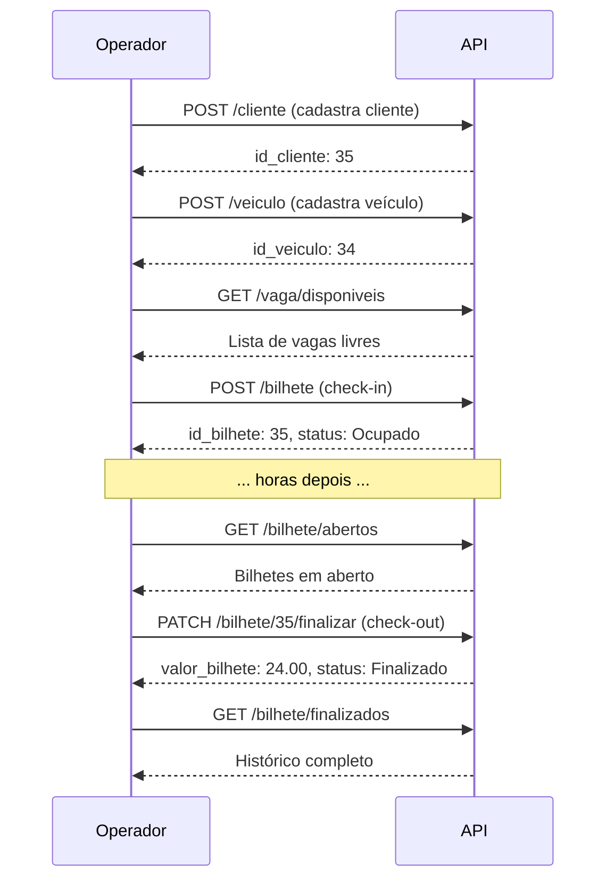

# 🅿️ Estacionamento API

API REST para gerenciamento de estacionamento, desenvolvida com **NestJS**, **Prisma 7** e **MariaDB**. Permite gerenciar clientes, veículos, vagas e bilhetes com cálculo automático de tarifas.

---

## 📋 Sumário

- [Tecnologias](#-tecnologias)
- [Pré-requisitos](#-pré-requisitos)
- [Instalação](#-instalação)
- [Configuração](#-configuração)
- [Execução](#-execução)
- [Endpoints](#-endpoints)
  - [Cliente](#-cliente)
  - [Veículo](#-veículo)
  - [Vaga](#-vaga)
  - [Bilhete](#-bilhete)
- [Regras de Negócio](#-regras-de-negócio)
- [Códigos HTTP](#-códigos-http)
- [Fluxo de Uso](#-fluxo-de-uso)
- [Estrutura do Projeto](#-estrutura-do-projeto)

---

## 🚀 Tecnologias

- [NestJS](https://nestjs.com/) — Framework Node.js progressivo
- [Prisma 7](https://www.prisma.io/) — ORM com driver adapters
- [MariaDB](https://mariadb.org/) — Banco de dados relacional (via XAMPP)
- [TypeScript](https://www.typescriptlang.org/) — Superset JavaScript
- [Insomnia](https://insomnia.rest/) — Cliente HTTP para testes

---

## ✅ Pré-requisitos

- **Node.js** 20.19.0+ (ideal 22.x)
- **TypeScript** 5.4.0+
- **XAMPP** com MySQL/MariaDB rodando
- Banco de dados `estacionamento` criado

---

## 📦 Instalação

```bash
# Clone o repositório
git clone <url-do-repositorio>
cd estacionamento-api

# Instale as dependências
npm install
```

---

## ⚙️ Configuração

### 1. Variáveis de ambiente

Crie um arquivo `.env` na raiz do projeto:

```env
DATABASE_URL="mysql://root:@localhost:3306/estacionamento"
DATABASE_USER="root"
DATABASE_PASSWORD=""
DATABASE_NAME="estacionamento"
DATABASE_HOST="localhost"
DATABASE_PORT=3306
```

### 2. Gerar o Prisma Client

```bash
npx prisma generate
```

### 3. Sincronizar o schema com o banco

```bash
npx prisma db pull
```

---

## ▶️ Execução

```bash
# Desenvolvimento (watch mode)
npm run start:dev

# Produção
npm run build
npm run start:prod
```

A API estará disponível em `http://localhost:3000`.

---

## 🌐 Endpoints

**URL Base:** `http://localhost:3000`

### 👤 Cliente

| Método | Rota | Descrição |
|--------|------|-----------|
| `POST` | `/cliente` | Cria um novo cliente |
| `GET` | `/cliente` | Lista todos os clientes |
| `GET` | `/cliente/:id` | Busca cliente por ID |
| `PATCH` | `/cliente/:id` | Atualiza cliente |
| `DELETE` | `/cliente/:id` | Remove cliente |

**Exemplo de criação:**

```json
POST /cliente
{
  "nome_cliente": "João Silva",
  "cpf_cliente": "123.456.789-00",
  "telefone_cliente": "(47) 99999-9999",
  "endereco_cliente": "Rua XV de Novembro, 100, Centro, Rio do Sul - SC"
}
```

---

### 🚗 Veículo

| Método | Rota | Descrição |
|--------|------|-----------|
| `POST` | `/veiculo` | Cadastra veículo |
| `GET` | `/veiculo` | Lista todos (com cliente aninhado) |
| `GET` | `/veiculo/:id` | Busca veículo + cliente + bilhetes |
| `PATCH` | `/veiculo/:id` | Atualiza veículo |
| `DELETE` | `/veiculo/:id` | Remove veículo |

**Exemplo de criação:**

```json
POST /veiculo
{
  "placa_veiculo": "ABC-1234",
  "marca_modelo_veiculo": "Fiat Uno 1.0",
  "cor_veiculo": "Azul",
  "Cliente_id_cliente": 1
}
```

---

### 🅿️ Vaga

| Método | Rota | Descrição |
|--------|------|-----------|
| `POST` | `/vaga` | Cria vaga |
| `GET` | `/vaga` | Lista todas as vagas |
| `GET` | `/vaga/disponiveis` | Lista apenas vagas livres |
| `GET` | `/vaga/:id` | Busca vaga + bilhetes ocupados |
| `PATCH` | `/vaga/:id` | Atualiza vaga |
| `DELETE` | `/vaga/:id` | Remove vaga |

**Exemplo de criação:**

```json
POST /vaga
{
  "numero_vaga": 31,
  "tipo_vaga": "Vaga Comum"
}
```

**Tipos válidos:** `"PCD"` ou `"Vaga Comum"`

---

### 🎫 Bilhete

| Método | Rota | Descrição |
|--------|------|-----------|
| `POST` | `/bilhete` | **Check-in** (abre bilhete) |
| `GET` | `/bilhete` | Lista todos os bilhetes |
| `GET` | `/bilhete/abertos` | Bilhetes com status `Ocupado` |
| `GET` | `/bilhete/finalizados` | Histórico finalizado |
| `GET` | `/bilhete/:id` | Busca bilhete por ID |
| `PATCH` | `/bilhete/:id` | Troca de vaga (só em aberto) |
| `PATCH` | `/bilhete/:id/finalizar` | **Check-out** (calcula valor) |
| `DELETE` | `/bilhete/:id` | Remove bilhete finalizado |

**Check-in:**

```json
POST /bilhete
{
  "Veiculo_id_veiculo": 5,
  "Vaga_id_vaga": 3
}
```

**Troca de vaga:**

```json
PATCH /bilhete/34
{
  "Vaga_id_vaga": 7
}
```

**Check-out (valor calculado automaticamente):**

```json
PATCH /bilhete/34/finalizar
{}
```

**Check-out com valor manual:**

```json
PATCH /bilhete/34/finalizar
{
  "valor_bilhete": 12.00
}
```

---

## 📜 Regras de Negócio

### 💰 Cálculo de Tarifa

- **Primeira hora:** R$ 8,00
- **Hora adicional:** R$ 8,00
- **Arredondamento:** para cima (fração de hora conta como hora cheia)
- **Valor máximo:** R$ 99,99 (limite do tipo `Decimal(4,2)`)

**Exemplos:**

| Tempo | Cálculo | Valor |
|-------|---------|-------|
| 30 min | 1ª hora | R$ 8,00 |
| 1h | 1ª hora | R$ 8,00 |
| 1h30 | 1h + 1 adicional | R$ 16,00 |
| 3h | 1h + 2 adicionais | R$ 24,00 |

### 🚫 Restrições

- **CPF** e **placa** são únicos
- **Vaga ocupada** não pode receber novo check-in
- **Veículo com bilhete aberto** não pode fazer novo check-in
- **Vaga ocupada** não pode ser deletada
- **Bilhete em aberto** não pode ser alterado nem removido
- **Bilhete finalizado** não pode ser finalizado novamente
- **Cliente com veículos** não pode ser removido
- **Veículo com bilhetes** não pode ser removido

---

## 📡 Códigos HTTP

| Código | Significado | Quando ocorre |
|--------|-------------|---------------|
| `200` | OK | GET, PATCH, DELETE com sucesso |
| `201` | Created | POST com sucesso |
| `400` | Bad Request | Regra de negócio violada |
| `404` | Not Found | ID inexistente |
| `409` | Conflict | Duplicidade ou vaga ocupada |
| `500` | Internal Server Error | Erro inesperado |

---

## 🔄 Fluxo de Uso

### Cenário completo de um estacionamento



### Passo a passo resumido

1. **Cadastrar cliente** → `POST /cliente`
2. **Cadastrar veículo** → `POST /veiculo`
3. **Verificar vagas** → `GET /vaga/disponiveis`
4. **Check-in** → `POST /bilhete`
5. **Check-out** → `PATCH /bilhete/:id/finalizar`
6. **Consultar histórico** → `GET /bilhete/finalizados`

---

## 📁 Estrutura do Projeto

```
src/
├── cliente/                     # CRUD de clientes
│   ├── dto/
│   │   ├── create-cliente.dto.ts
│   │   └── update-cliente.dto.ts
│   ├── cliente.controller.ts
│   ├── cliente.module.ts
│   └── cliente.service.ts
│
├── veiculo/                     # CRUD de veículos
│   ├── dto/
│   ├── veiculo.controller.ts
│   ├── veiculo.module.ts
│   └── veiculo.service.ts
│
├── vaga/                        # CRUD de vagas
│   ├── dto/
│   ├── vaga.controller.ts
│   ├── vaga.module.ts
│   └── vaga.service.ts
│
├── bilhete/                     # CRUD de bilhetes (check-in/out)
│   ├── dto/
│   ├── bilhete.controller.ts
│   ├── bilhete.module.ts
│   └── bilhete.service.ts
│
├── prisma/                      # Módulo global do Prisma
│   ├── prisma.module.ts
│   └── prisma.service.ts
│
├── generated/prisma/            # Cliente Prisma gerado (Prisma 7)
│
├── app.module.ts
└── main.ts
```

---

## 📊 Árvore de Rotas

```
http://localhost:3000
│
├── /cliente
│   ├── POST   /
│   ├── GET    /
│   ├── GET    /:id
│   ├── PATCH  /:id
│   └── DELETE /:id
│
├── /veiculo
│   ├── POST   /
│   ├── GET    /
│   ├── GET    /:id
│   ├── PATCH  /:id
│   └── DELETE /:id
│
├── /vaga
│   ├── POST   /
│   ├── GET    /
│   ├── GET    /disponiveis
│   ├── GET    /:id
│   ├── PATCH  /:id
│   └── DELETE /:id
│
└── /bilhete
    ├── POST   /
    ├── GET    /
    ├── GET    /abertos
    ├── GET    /finalizados
    ├── GET    /:id
    ├── PATCH  /:id
    ├── PATCH  /:id/finalizar
    └── DELETE /:id
```

---

## 🧪 Testando com Insomnia

Importe a coleção abaixo no Insomnia para testar todos os endpoints rapidamente:

```json
{
  "_type": "export",
  "__export_format": 4,
  "__export_source": "estacionamento-api",
  "resources": [
    {
      "_id": "req_cliente_list",
      "_type": "request",
      "parentId": "wrk_est",
      "name": "Listar Clientes",
      "method": "GET",
      "url": "http://localhost:3000/cliente"
    },
    {
      "_id": "req_veiculo_list",
      "_type": "request",
      "parentId": "wrk_est",
      "name": "Listar Veículos",
      "method": "GET",
      "url": "http://localhost:3000/veiculo"
    },
    {
      "_id": "req_vaga_disp",
      "_type": "request",
      "parentId": "wrk_est",
      "name": "Vagas Disponíveis",
      "method": "GET",
      "url": "http://localhost:3000/vaga/disponiveis"
    },
    {
      "_id": "req_bilhete_abertos",
      "_type": "request",
      "parentId": "wrk_est",
      "name": "Bilhetes Abertos",
      "method": "GET",
      "url": "http://localhost:3000/bilhete/abertos"
    },
    {
      "_id": "req_bilhete_finalizados",
      "_type": "request",
      "parentId": "wrk_est",
      "name": "Bilhetes Finalizados",
      "method": "GET",
      "url": "http://localhost:3000/bilhete/finalizados"
    }
  ]
}
```

---

## 🗺️ Roadmap

- [x] CRUD de clientes
- [x] CRUD de veículos
- [x] CRUD de vagas
- [x] CRUD de bilhetes com check-in/out
- [x] Cálculo automático de tarifa
- [ ] Documentação com Swagger
- [ ] Validação com `class-validator`
- [ ] Autenticação JWT
- [ ] Testes automatizados (Jest + Supertest)
- [ ] Paginação e filtros
- [ ] Relatórios de faturamento
- [ ] Deploy em produção

---

## 📝 Licença

Este projeto está sob a licença MIT.

---

## 👨‍💻 Autor
Daniel Baumann
Desenvolvido como projeto de estudo de **NestJS + Prisma 7 + MariaDB**.

---

<p align="center">
  Feito com ❤️ usando NestJS e Prisma 7
</p>